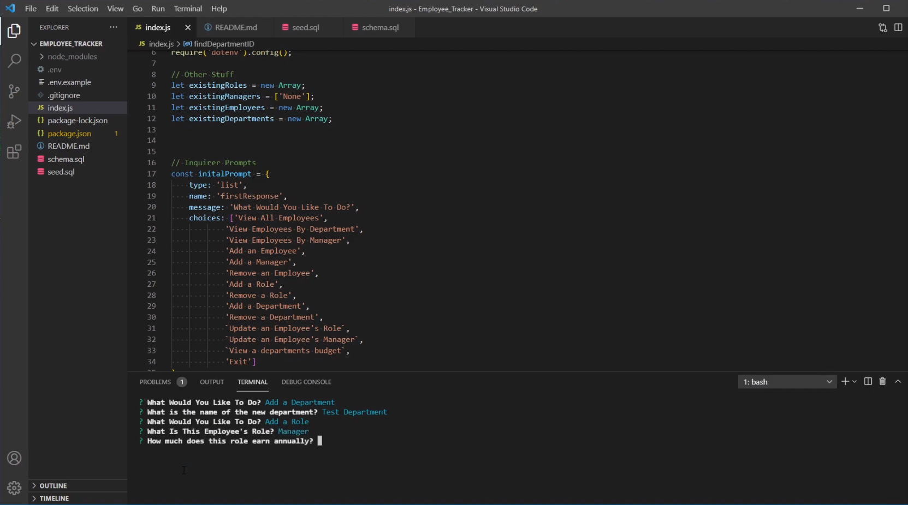

## Video Tutorial
https://www.youtube.com/watch?v=EaF2okS-Bt0

# Employee_Tracker

# Contact
Vygoth
JeremyJoanet@Protonmail.com

## Description
This application allows users to create departments, roles and employees in a database, assign managers to employees, track employees based on department, manager and all, update managers and roles, and view a departments total used salary.

## Table of Contents
- [Usage](#Usage)
- [Installation](#Dependancies)
- [Credits](#Credits)
- [Screenshot](#Screenshot)

## Usage
To use the repo, type node server.js in a terminal opened on the file location, follow the prompts. Exit will stop the application.

## Dependancies
NPM Install

## Credits
Zach Duty, Matt Reisdorf, Michael Francisco.

## Screenshot

